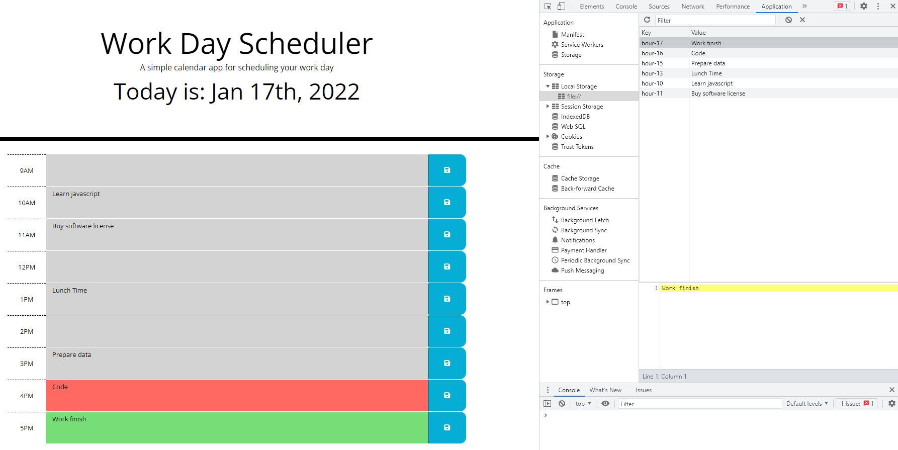

# Work-Day-Scheduler
A simple calendar application that allows a user to save events for each hour of the day by modifying starter code. This app will run in the browser and feature dynamically updated HTML and CSS powered by jQuery.

# [Web Link](https://hongnodie.github.io/Work-Day-Scheduler/)
# [Github Repo](https://github.com/Hongnodie/Work-Day-Scheduler.git)

## About the Project

As I proceed in my career as a web developer, I will probably be asked to complete a coding assessment. These assessments are typically a combination of multiple-choice questions and interactive challenges. As a bootcamp student, I want to build a code quiz application with multiple-choice questions on JavaScript that stores high scores so I can gauge my progress compared my peers. 

## Client's Requirements

Initial design of the app has the following deliverables:

GIVEN I am using a daily planner to create a schedule
WHEN I open the planner
THEN the current day is displayed at the top of the calendar
WHEN I scroll down
THEN I am presented with timeblocks for standard business hours
WHEN I view the timeblocks for that day
THEN each timeblock is color coded to indicate whether it is in the past, present, or future
WHEN I click into a timeblock
THEN I can enter an event
WHEN I click the save button for that timeblock
THEN the text for that event is saved in local storage
WHEN I refresh the page
THEN the saved events persist

## Demo

## Screenshot

## Resources

